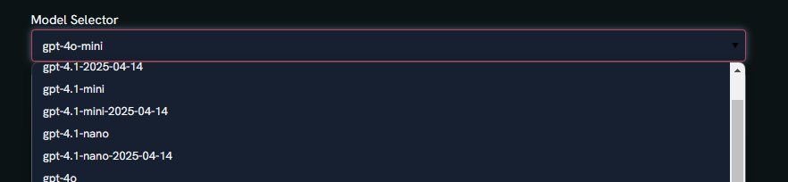
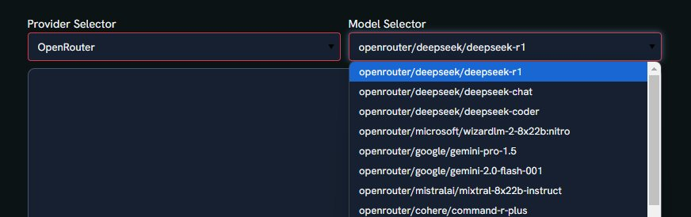

The `LLMChatElement` is a core component for integrating Large Language Models (LLMs) into chat applications. It handles the communication with LLM providers and generates responses based on input messages. Its interface is meant to receive `list[MessagePayload]` and respond with a `MessagePayload` in turn.

## Instantiation

##### OpenRouter (default)

By default, this element uses the [OpenRouter Python SDK](https://openrouter.ai/docs/sdks/python) and OpenRouter model names such as `openai/gpt-4o-mini`.
When this Element is instantiated, unless a `env_path` is provided, it will look in the working directory for an `.env` file.

##### APIs

For OpenRouter-backed requests, set `OPENROUTER_API_KEY` in your `.env` file (or process environment).  
The OpenRouter backend explicitly loads `.env` at runtime and then reads `OPENROUTER_API_KEY`.
If this key is missing, `LLMChatElement` raises a clear credential error before sending the request.
When running recipes, pass your env file explicitly (for example `pyllments recipe run chat --env .env`) so process-level environment values are available consistently.

##### LiteLLM (alternate backend)

If you need broad provider routing via LiteLLM model registries or custom local endpoints, switch backend to `litellm`. LiteLLM uses its [standard model naming system](https://models.litellm.ai) and API key setup documented [here](https://docs.litellm.ai/docs/set_keys).

##### Local
Local model endpoints (`ollama`, `vLLM`, etc.) are supported through the `litellm` backend by supplying `model_name` and `base_url`. See [LiteLLM local provider docs](https://docs.litellm.ai/docs/providers/ollama).

**Arguments:**

`backend`: Literal['openrouter', 'litellm'] = 'openrouter' 
Selects which concrete chat backend model implementation is used under the hood.
`model_name`: str = 'openai/gpt-4o-mini' 
The name of the model to use for the LLM.
`model_args`: dict = {} 
Additional arguments to pass to the model.
`base_url`: str = None 
LiteLLM-only. Base URL for custom/local model endpoints.
`output_mode`: Literal['atomic', 'stream'] = 'stream' 
Whether to return the message containing a streaming callback or an atomic one
`env_path`: str = None 
Path to the .env file to load. If not provided, the .env file in the current working directory will be used.

### Input Ports

| Port Name            | Payload Type                                          | Behavior                                                                 |
|----------------------|-------------------------------------------------------|---------------------------------------------------------------------------|
| messages_emit_input  | Union[MessagePayload, List[Union[MessagePayload, ToolsResponsePayload]]] | Processes incoming messages or lists of messages/tool responses to generate an LLM response which is emitted from the `message_output` port. |

: {.hover}

### Output Ports

| Port Name            | Payload Type          | Behavior                                                        |
|----------------------|-----------------------|-----------------------------------------------------------------|
| message_output       | MessagePayload        | Emits a `MessagePayload` containing the LLM's response to the next element. |

: {.hover}

### Views


| View Name            | Description                                                                 | Image                                      |
|----------------------|-----------------------------------------------------------------------------|--------------------------------------------|
| model_selector_view  | Allows selection of backend model names for generating responses. On `litellm`, provider + model selection remains available. On `openrouter`, the selector shows a curated set of major providers (max 6) and updates models by selected provider (for example OpenAI, Anthropic, Google, xAI, Mistral, Meta). **Args:** `models: list or dict, optional` A list or dict of models. If a dict, the keys are used as display names. `show_provider_selector: bool, default True` Whether to include a provider selection widget. `provider: str, default 'OpenAI'` Used by LiteLLM provider selection. `model: str or dict, default 'openai/gpt-4o-mini'` The default model to pre-select. `orientation: {'vertical', 'horizontal'}, default 'horizontal'` Layout orientation for the provider and model selectors. `model_selector_width: int = None` `provider_selector_width: int = None` `selector_css: list[str] = []` `height: int = 57` | With provider: {.lightbox} Without provider: {.lightbox} |

