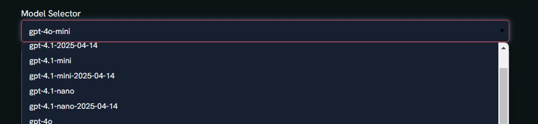
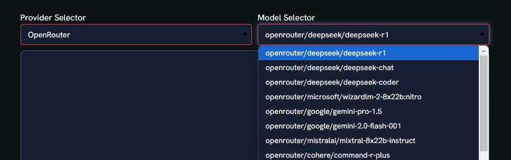

The `LLMChatElement` is a core component for integrating Large Language Models (LLMs) into chat applications. It handles the communication with LLM providers and generates responses based on input messages. Its interface is meant to receive `list[MessagePayload]` and respond with a `MessagePayload` in turn.

## Instantiation

##### OpenRouter (default)

By default, this element uses the [OpenRouter Python SDK](https://openrouter.ai/docs/sdks/python) and OpenRouter model names such as `openai/gpt-4o-mini`.
When this Element is instantiated, unless a `env_path` is provided, it will look in the working directory for an `.env` file.

##### APIs

For OpenRouter-backed requests, set `OPENROUTER_API_KEY` in your `.env` file (or process environment).  
The OpenRouter backend explicitly loads `.env` at runtime and then reads `OPENROUTER_API_KEY`.
If this key is missing, `LLMChatElement` raises a clear credential error before sending the request.
When running recipes, pass your env file explicitly (for example `pyllments recipe run chat --env .env`) so process-level environment values are available consistently.

##### LiteLLM (alternate backend)

If you need broad provider routing via LiteLLM model registries or custom local endpoints, switch backend to `litellm`. LiteLLM uses its [standard model naming system](https://models.litellm.ai) and API key setup documented [here](https://docs.litellm.ai/docs/set_keys).

##### Anthropic and OpenAI (direct)

`backend='anthropic'` calls Anthropic's Messages API and `backend='openai'` calls OpenAI's Responses API, each over plain HTTP with no SDK (inside a Cloudflare Worker through the Workers `fetch`). Keys come from `api_key` or `ANTHROPIC_API_KEY` / `OPENAI_API_KEY`. Both cache prompts automatically: Anthropic through a top-level `cache_control` plus a fixed breakpoint after the leading system messages (`cache='off'` turns that off), OpenAI on its side. The OpenAI request is stateless (`store: false`); `base_url` points it at another host that speaks the Responses API. The Anthropic backend knows where Claude models differ: models before 4.6 get no adaptive thinking, and a forced tool call becomes a normal one on the models that reject it (Sonnet and Opus 5.5 on, Fable and Mythos 5.1 on).

A reply that reasoned keeps it in `MessageModel.reasoning`, in the provider's own opaque form (Anthropic's signed thinking blocks, OpenAI's encrypted reasoning items), and a backend sends back the reasoning that came from its own provider. How long a reply keeps it is the history's business: [HistoryHandlerElement](../HistoryHandlerElement/index.qmd) shows it for its turn only. Every reply also carries `MessageModel.usage` (`input_tokens` for the whole prompt, `cached_input_tokens`, `cache_write_tokens`, `output_tokens`; `cache_share` divides them).

##### One string for provider and model

With `backend='auto'`, `model_name` names both: `anthropic/claude-haiku-5-5`, `openai/gpt-5.5`, `@cf/meta/llama-3.3-70b-instruct-fp8-fast` (Workers AI) or `cloudflare/openai/gpt-5.5` (a third-party model through Cloudflare's AI Gateway). `provider_params` holds each backend's own settings, such as its key, and `set_model('openai/gpt-5.5')` switches between turns with the tools carried over. A cache belongs to one model, so the first request on a new model pays for its prompt once.

##### Did the request only append?

Each reply's `MessageModel.request_check` says whether its request was the previous one plus appended messages, which every provider's prompt cache needs: `appended`, `changed_at` (the first message that differs), `same_turn`, `settings_changed` (model, tools or request options). A change within a turn is logged as a warning: it costs a cache miss and, on Anthropic, the turn's reasoning.

##### Local
Local model endpoints (`ollama`, `vLLM`, etc.) are supported through the `litellm` backend by supplying `model_name` and `base_url`. See [LiteLLM local provider docs](https://docs.litellm.ai/docs/providers/ollama).

**Arguments:**

`backend`: Literal['mock', 'openrouter', 'litellm', 'cloudflare', 'anthropic', 'openai', 'auto'] = 'openrouter' 
Selects which concrete chat backend model implementation is used under the hood.
`model_name`: str = 'openai/gpt-4o-mini' 
The name of the model to use for the LLM.
`model_args`: dict = {} 
Additional arguments to pass to the model.
`base_url`: str = None 
LiteLLM-only. Base URL for custom/local model endpoints.
`output_mode`: Literal['atomic', 'stream'] = 'stream' 
Whether to return the message containing a streaming callback or an atomic one
`generate_content_on_emit`: bool = False 
When `True`, awaits full message content via `aget_message()` before emitting on `message_output`. Keep `False` when using `ChatGatewayElement` or other consumers that call `aiter_events()` on the emitted payload.
`env_path`: str = None 
Path to the .env file to load. If not provided, the .env file in the current working directory will be used.

::: {.callout-note}
For production streaming with [ChatGatewayElement](../ChatGatewayElement/index.qmd), use `output_mode='stream'` and `generate_content_on_emit=False` so the assistant stream remains available to your application's `TurnHandle.stream()`.
:::

### Input Ports

| Port Name            | Payload Type                                          | Behavior                                                                 |
|----------------------|-------------------------------------------------------|---------------------------------------------------------------------------|
| `messages_emit_input`  | `MessagePayload`, `ToolUsePayload`, or lists of those payloads | Processes incoming messages or lists of messages/tool-use payloads to generate an LLM response emitted from `message_output`. |
| `tools_input`  | `StructuredPayload` | Receives provider-ready tool definitions (from `ToolUseElement.tools_output`) and forwards them into the LLM API request. |

: {.hover}

### Output Ports

| Port Name            | Payload Type          | Behavior                                                        |
|----------------------|-----------------------|-----------------------------------------------------------------|
| message_output       | MessagePayload        | Emits a `MessagePayload` containing the LLM's response to the next element. |

: {.hover}

### Views


| View Name            | Description                                                                 | Image                                      |
|----------------------|-----------------------------------------------------------------------------|--------------------------------------------|
| model_selector_view  | Allows selection of backend model names for generating responses. On `litellm`, provider + model selection remains available. On `openrouter`, the selector shows a curated set of major providers (max 6) and updates models by selected provider (for example OpenAI, Anthropic, Google, xAI, Mistral, Meta). **Args:** `models: list or dict, optional` A list or dict of models. If a dict, the keys are used as display names. `show_provider_selector: bool, default True` Whether to include a provider selection widget. `provider: str, default 'OpenAI'` Used by LiteLLM provider selection. `model: str or dict, default 'openai/gpt-4o-mini'` The default model to pre-select. `orientation: {'vertical', 'horizontal'}, default 'horizontal'` Layout orientation for the provider and model selectors. `model_selector_width: int = None` `provider_selector_width: int = None` `selector_css: list[str] = []` `height: int = 57` | With provider: {.lightbox} Without provider: {.lightbox} |

