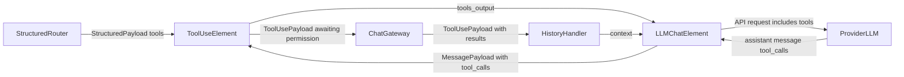

The `ToolUseElement` is the framework element for model tool use. It aggregates tool definitions from registered adapters (MCP servers, local Python functions), emits provider-ready schemas, normalizes incoming tool requests, routes permission-gated calls through a gateway, and executes approved tool uses.

Schema outputs use **latched emission**: when adapter resources become ready, schemas are emitted and replayed to ports connected afterward. Connection itself is topology only.

Execution stays in the element and its adapters. `ToolUsePayload` stores only serializable lifecycle state—no embedded callables.

## Typical Flow



## Instantiation

**Arguments:**

`adapters: list[ToolAdapter], optional`<br>
<span class="tab">Explicit adapter instances. When omitted, `mcps` and `functions` are expanded via `build_adapters`.</span>

`mcps: dict, optional`<br>
<span class="tab">Convenience mapping of server names to MCP configurations (see [MCPElement](../MCPElement/index.qmd) for config keys). Entries with `type: functions` are split into `FunctionToolAdapter` instances.</span>

`functions: list | dict, optional`<br>
<span class="tab">Local Python callables registered through `FunctionToolAdapter`.</span>

`tools_requiring_permission: list[str], optional`<br>
<span class="tab">Tool names that require user approval before execution (used with `functions=`).</span>

`name: str, optional`<br>
<span class="tab">Durable executor identity stored on emitted `ToolUsePayload.executor_element_name`. Each `ToolUseElement` registers itself by this name when constructed. Set explicitly (for example `name="main_tools"`) when multiple chats or flows are active. For dynamic multi-chat flows, prefix with the application chat/flow id (for example `name=f"{chat_id}:main_tools"`). Generated names are acceptable only when construction order is deterministic and the flow does not rely on cross-restart identity.</span>

**Example:**

```python
from pyllments.elements import ToolUseElement

tool_use_el = ToolUseElement(
    name="main_tools",
    mcps={
        "todo": {
            "type": "script",
            "script": "todo_server.py",
            "tools_requiring_permission": ["remove_todo"],
        },
    },
    functions={"calculate": calculate, "get_time": get_current_time},
)
```

### Input Ports

| Port Name | Payload Type | Behavior |
|-----------|--------------|----------|
| `tool_request_structured_input` | `StructuredPayload` | Receives `model.data` as a list of `{"name": str, "parameters": dict}` entries from structured-router flows. Builds a `ToolUsePayload` and emits on `tool_use_output`. Executes immediately when no permission is required. [Example](#sec-tool_request_structured_input) |
| `tool_request_message_input` | `MessagePayload` | Reads native `model.tool_calls` (OpenAI/LiteLLM shape) after the message is ready. Parses `function.arguments` JSON into parameters and preserves turn/correlation metadata. [Example](#sec-tool_request_message_input) |
| `approved_tool_use_input` | `ToolUsePayload` | Compatibility input for direct approval flows. Gateway-controlled flows execute through the payload binding instead. |
| `denied_tool_use_input` | `ToolUsePayload` | Compatibility input for direct denial flows. Gateway-controlled flows emit denial results from the gateway. |

: {.hover}

### Output Ports

| Port Name | Payload Type | Behavior |
|-----------|--------------|----------|
| `tools_schema_output` | `SchemaPayload` | Emits a Pydantic schema describing available tools for structured routing. |
| `tools_output` | `StructuredPayload` | Provider-ready tool definitions (`type: function` entries) for `LLMChatElement.tools_input`. |
| `structured_tools_output` | `StructuredPayload` | Flat `{name, description, parameters}` list for structured-router consumers. |
| `tool_use_output` | `ToolUsePayload` | Emits requested tool-use payloads (including those awaiting permission). |
| `tool_result_output` | `ToolUsePayload` | Emits payloads after execution or denial with results/errors attached. |

: {.hover}

## Permission Flow

When a tool spec has `permission_required=True`, the element emits the payload on `tool_use_output` and waits for the gateway/application to decide. Wire the gateway boundary:

```python
tool_use_el = ToolUseElement(name="main_tools", functions=[...])
gateway = ChatGatewayElement()

tool_use_el.ports.tool_use_output > gateway.ports.tool_use_input
gateway.ports.tool_result_output > history_handler_el.ports.payload_emit_input
```

The gateway inspects per-record `permission_required`, `permission.status`, and `status`. It approves or denies selected records and executes approved records through the payload's assigned `ToolUseElement`. Hydrated payloads rebind automatically by `executor_element_name` against the live `ToolUsePayload` executor registry.

## Executor Identity and Rebinding

Each `ToolUseElement` registers itself with `ToolUsePayload` at construction time. Emitted payloads store the durable owner name:

```python
payload.model.executor_element_name == tool_use_el.name
```

For multiple active chats or cold-start recovery, give each flow a unique tool element name:

```python
tool_use_el = ToolUseElement(name=f"{chat_id}:main_tools", functions=[...])
```

After restart, recreate the `ToolUseElement` with the same name before hydrating pending tool permissions.

## Data Flow Details

### tool_request_structured_input payload {#sec-tool_request_structured_input}

**payload.model.data**:

```python
[
    {"name": "todo_add", "parameters": {"task": "Buy milk"}},
    {"name": "weather_get", "parameters": {"city": "SF"}},
]
```

### tool_request_message_input payload {#sec-tool_request_message_input}

**payload.model.tool_calls**:

```python
[
    {
        "id": "call_abc123",
        "type": "function",
        "function": {
            "name": "todo_add",
            "arguments": '{"task": "Buy milk"}',
        },
    }
]
```

### tool_result_output payload {#sec-tool_result_output}

**payload.model.tool_calls** (ordered serializable records):

```python
[
    {
        "adapter_name": "mcp",
        "provider_name": "weather",
        "tool_name": "get",
        "model_tool_name": "weather_get",
        "parameters": {"city": "SF"},
        "permission_required": False,
        "permission": {"status": "not_required"},
        "status": "succeeded",
        "result": {
            "content": [{"type": "text", "text": "54F in San Francisco"}],
        },
        "error": None,
    }
]
```

Aggregate payload status progresses through `pending`, `awaiting_permission`, `approved`, `running`, and terminal states (`succeeded`, `failed`, `denied`, `cancelled`).

### tools_schema_output payload {#sec-tools_schema_output}

**payload.model.schema**: Pydantic `tool_array` schema with one model per registered tool name (same shape as the previous MCP element schema output).

### tools_output payload {#sec-tools_output}

**payload.model.data**: OpenAI-compatible function definitions:

```python
[
    {
        "type": "function",
        "function": {
            "name": "todo_add",
            "description": "Add a todo item",
            "parameters": {"type": "object", "properties": {"task": {"type": "string"}}},
        },
    }
]
```

## Typical Wiring

```python
tool_use_el.ports.tools_output > llm_chat_el.ports.tools_input
llm_chat_el.ports.message_output > tool_use_el.ports.tool_request_message_input
tool_use_el.ports.tool_result_output > history_handler_el.ports.payload_emit_input
```

For structured-router tool selection:

```python
structured_router_el.ports.output > tool_use_el.ports.tool_request_structured_input
```

## Related documentation

- [MCPElement](../MCPElement/index.qmd) — convenience wrapper for MCP-focused setups
- [ChatGatewayElement](../ChatGatewayElement/index.qmd) — permission boundary for tool use
- [LLMChatElement](../LLMChatElement/index.qmd) — native tool definition input and tool-call output
